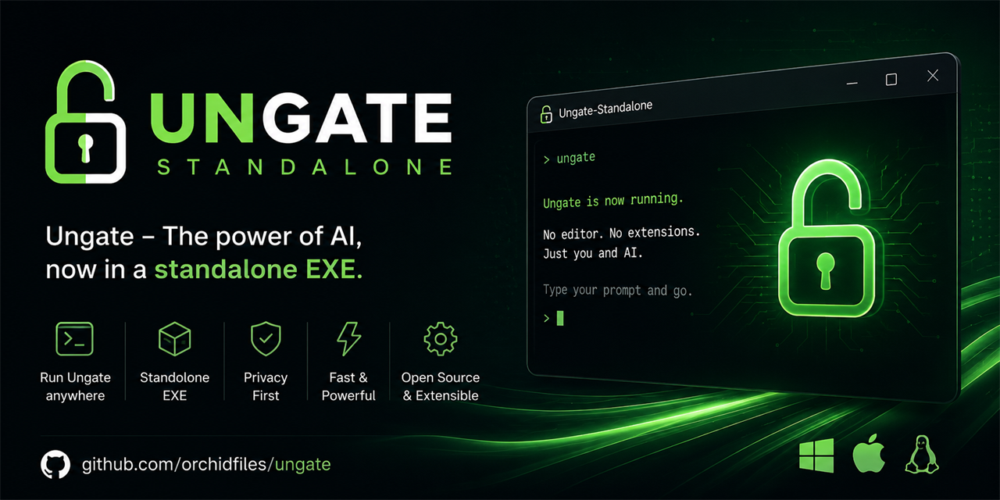
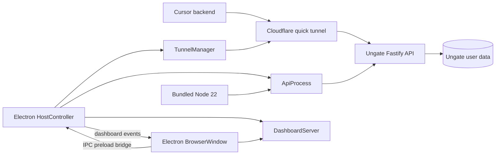

<p align="center"></p>

# Ungate Standalone

> A desktop host for [Ungate](https://github.com/orchidfiles/ungate) that runs the local OpenAI-compatible proxy, serves the Ungate dashboard, and optionally exposes the API through a Cloudflare quick tunnel.

<p align="center">
  <a href="https://github.com/Crome696/ungate-standalone/actions/workflows/build.yml"></a>
  
</p>

## Project Snapshot

| Field               | Value                                                    |
| ------------------- | -------------------------------------------------------- |
| Product             | Ungate Standalone                                        |
| Platforms           | Windows x64, macOS x64/arm64, Linux x64/arm64            |
| Host                | Electron 35                                              |
| Bundled API runtime | Node.js 22.16.0                                          |
| Package manager     | [pnpm](https://pnpm.io/) 10+                             |
| Upstream            | Ungate Git submodule `v1.7.10`                           |
| Release artifacts   | Windows portable/NSIS, macOS DMG/zip, Linux AppImage/deb |
| License             | [MIT](LICENSE)                                           |

## What It Does

Cursor sends custom OpenAI Base URL traffic from its backend (`api2.cursor.sh`), so a local-only API is not directly reachable from that context. Ungate Standalone keeps the local proxy and dashboard available without relying on the Cursor extension host.

At startup, the Electron host:

1. Starts Ungate's Fastify API as a separate process using a bundled Node.js 22 runtime.
2. Serves the Ungate web dashboard from a loopback HTTP server and opens it in an Electron window.
3. Optionally starts a Cloudflare quick tunnel that forwards a public URL to the local API port.

Credentials and analytics remain in `$HOME/.ungate` (`%USERPROFILE%\.ungate` on Windows), the same user-level location used by the Cursor extension.

## Key Features

- Electron host with native packaging for Windows, macOS, and Linux.
- Bundled Node.js 22 runtime for the API process, selected per OS and CPU architecture.
- Automatic `better-sqlite3` native-binding compatibility handling for the bundled runtime.
- Local dashboard server with an Electron BrowserWindow and preload-based IPC bridge.
- Cloudflare quick-tunnel lifecycle management with user-level binary installation.
- API and tunnel status propagation, log buffering, restart controls, and error reporting.
- Cursor setup guidance with the known standalone Agent Mode limitations.

## Architecture



The API runs separately from the Electron host. `HostController` coordinates the API process, dashboard server, tunnel manager, BrowserWindow, and dashboard event flow. The dashboard and tunnel target the local API port; the tunnel is optional and is the point at which the API becomes externally reachable.

## Project Structure

- [`src/host-controller.ts`](src/host-controller.ts) — central Electron orchestrator for the API, dashboard, tunnel, BrowserWindow, and IPC events.
- [`src/api-process.ts`](src/api-process.ts) — API process lifecycle, health checks, port detection, restart behavior, and process logs.
- [`src/dashboard-server.ts`](src/dashboard-server.ts) — loopback HTTP server for the web UI and the VS Code webview compatibility shim.
- [`src/tunnel-manager.ts`](src/tunnel-manager.ts) — Cloudflare quick-tunnel lifecycle, binary discovery, installation, and status events.
- `src/paths.ts` — development and packaged-resource path resolution.
- [`scripts/prepare-resources.mjs`](scripts/prepare-resources.mjs) — builds Ungate, stages API/Web resources, downloads Node.js 22 runtimes, and prepares native SQLite resources.
- [`scripts/package-current.mjs`](scripts/package-current.mjs) — packages the current host OS with electron-builder.
- `vendor/ungate/` — upstream Ungate Git submodule pinned to `v1.7.10`.
- `resources/` — generated API bundle, web UI, runtimes, and application icon used by development and packaging.

## Getting Started

### Prerequisites

- Windows x64, macOS (Intel or Apple Silicon), or Linux (x64 or arm64).
- [pnpm](https://pnpm.io/) 10 or newer.
- Git for the Ungate submodule.
- Network access for dependency installation, resource preparation, and native/runtime downloads.

`pnpm run build` packages **the current OS only**. macOS and Linux artifacts must be produced on those operating systems, or through the GitHub Actions matrix in [`.github/workflows/build.yml`](.github/workflows/build.yml).

### Build the application

From an initialized checkout:

```sh
git submodule update --init --recursive
pnpm install
pnpm run build
```

Resource preparation downloads Node.js 22 and `better-sqlite3` prebuilds for Windows x64, macOS x64/arm64, and Linux x64/arm64. Packaging then embeds the runtime that matches the electron-builder target.

The current-OS build creates:

**Windows** (`pnpm run build` or `pnpm run build:win`)

- `release/UngateStandalone.exe` — portable application.
- `release/UngateStandalone-Setup.exe` — NSIS installer.
- `release/win-unpacked/UngateStandalone.exe` — unpacked folder build.

**macOS** (`pnpm run build` or `pnpm run build:mac`, x64 and arm64)

- `release/UngateStandalone-<version>-mac-<arch>.dmg`
- `release/UngateStandalone-<version>-mac-<arch>.zip`

macOS builds are unsigned. Open the app with right-click → Open the first time, or remove the quarantine attribute after download.

**Linux** (`pnpm run build` or `pnpm run build:linux`, x64 and arm64)

- `release/UngateStandalone-<version>-linux-<arch>.AppImage`
- `release/UngateStandalone-<version>-linux-<arch>.deb`

## Usage and Examples

1. Start Ungate Standalone (`UngateStandalone.exe` on Windows, the `.app` from the DMG on macOS, or the AppImage/deb package on Linux).
2. In the dashboard, connect Claude, ChatGPT, and/or MiniMax.
3. Start the tunnel and copy the public URL plus the proxy API key.
4. Paste those values into Cursor model settings.
5. Add the Ungate custom model IDs in Cursor and select one of them.

## Configuration

In Cursor, configure:

- `Cursor Settings → Models → OpenAI Base URL` — the tunnel URL with `/v1` appended.
- `OpenAI API Key` — the proxy key displayed by the Ungate dashboard.
- A custom model ID copied from the Ungate dashboard; built-in IDs such as Composer are not replaced by this standalone host.

If Cursor disables the API-key setting, enable `Keep OpenAI API Key enabled` in Cursor yourself. The standalone host does not provide the extension's OpenAI Key Fix feature.

## Development and Testing

Prepare generated resources before starting the development host:

```sh
pnpm run prepare:resources
pnpm run dev
```

The repository currently exposes lint and formatting checks rather than a dedicated automated test script:

```sh
pnpm run lint
pnpm run format:check
```

## Deployment and Operations

`pnpm run build` packages the current host OS. Use `pnpm run build:win`, `pnpm run build:mac`, or `pnpm run build:linux` to target one platform explicitly. Architecture-specific Linux CI scripts are `pnpm run build:linux:x64` and `pnpm run build:linux:arm64`. GitHub Actions builds Windows, macOS, Linux x64 (`ubuntu-latest`), and Linux arm64 (`ubuntu-24.04-arm`) on `v*` tags and `workflow_dispatch`. Linux artifacts upload as `ungate-standalone-linux-x64` and `ungate-standalone-linux-arm64`.

The application uses a bundled Node.js runtime for the API process because native `better-sqlite3` bindings must match the runtime ABI. Packaged apps install `cloudflared` into `$HOME/.ungate/bin` for the running platform instead of shipping the host npm binary.

When no development `cloudflared` binary is available, the tunnel manager installs or reuses one under `$HOME/.ungate/bin`. The tunnel can be started, stopped, and restarted from the dashboard while the API remains managed by the Electron host.

## Security, Data, and Limitations

- The dashboard server and tunnel target a local loopback API port.
- Starting the Cloudflare tunnel exposes the API through a public URL; treat the proxy API key as a secret.
- Credentials and analytics are stored under `$HOME/.ungate`.
- The standalone host keeps the proxy and tunnel alive without the Cursor extension, but it cannot force Cursor Agent Mode to use Ungate.
- Cloud Agents cannot reach a proxy running on the local machine.
- The extension's OpenAI Key Fix toggle is not available in this application.

## License and Credits

This project is licensed under the [MIT License](LICENSE). Ungate remains an unmodified Git submodule and is MIT-licensed by [orchidfiles.com](vendor/ungate/LICENSE).
